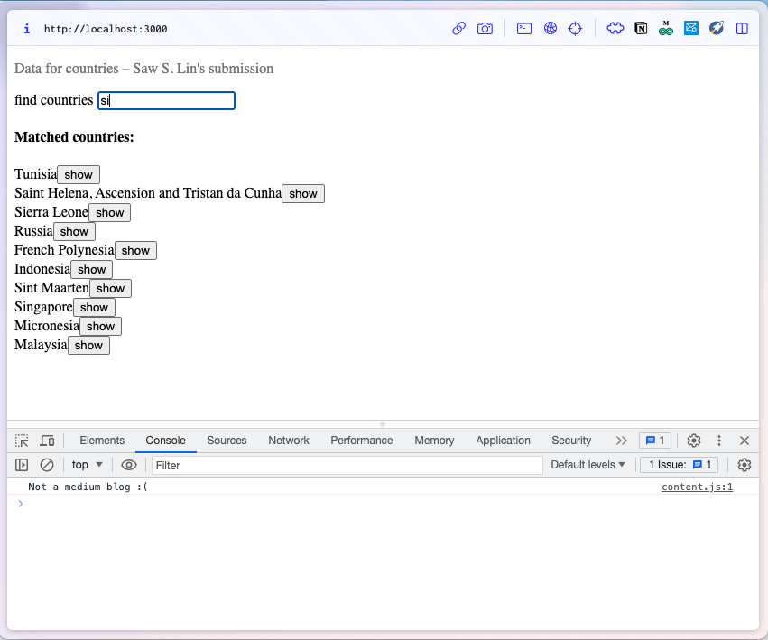

# "Data for coutries" exercises - Saw S. Lin's submission
## Step 1. Type in query 's'

## Step 2. Click "show" button on "Singapore"

## Step 3. Country "Singapore" is shown. 
| 3a. Country info is shown. | 3b. Weather in the capital is shown. |
|:-------:|:-------:|
|  |  |