# "Phonebook" exercises - Saw S. Lin's submission
Finished exercises 2.6 - 2.17

## "Phonebook" app main page
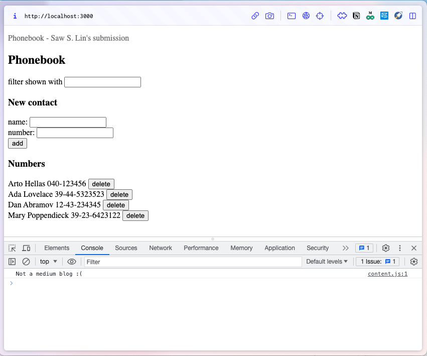 

## 1. Search for people whose name contains 'da'
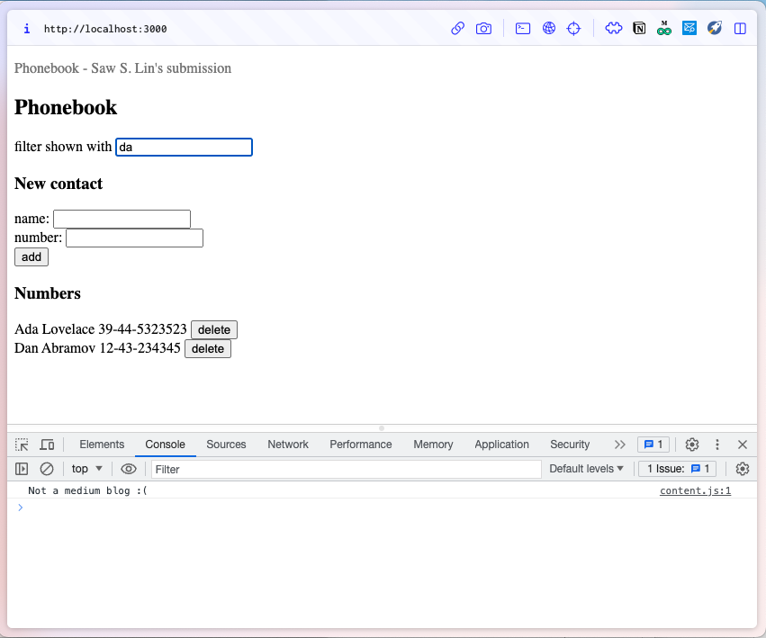

## 2. Add new person
| a. Type in new person's name and number | b. New person successfully added |
|:-------:|:-------:|
| 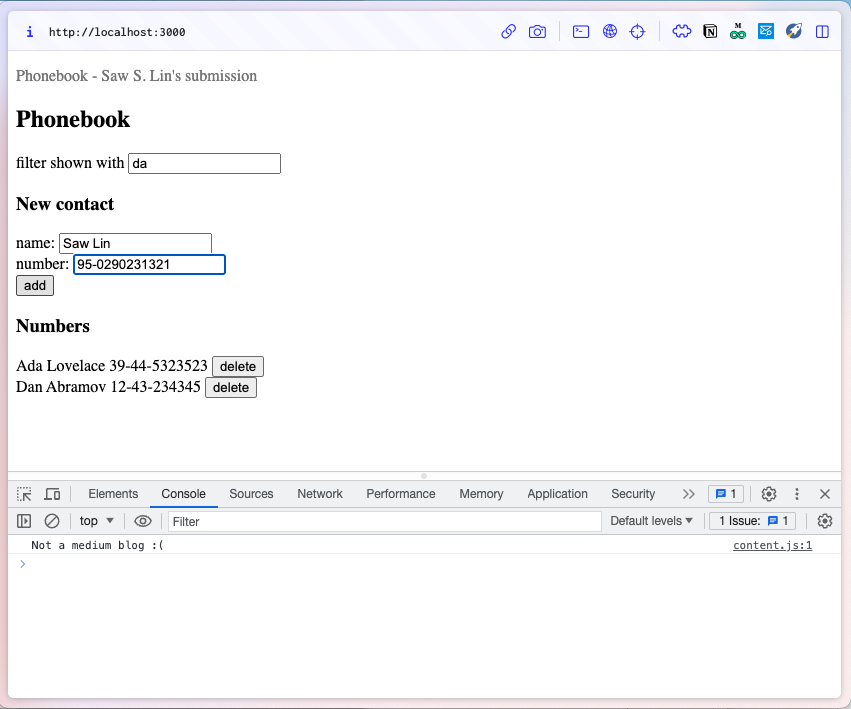 | 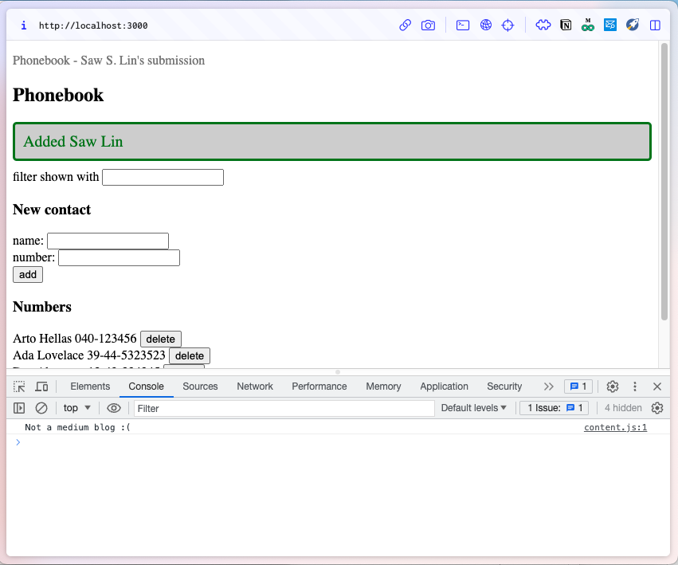 |

## 3. Update a person's number
| a. Type in an existing person's name and number | b. Confirm updating the number | c. Number successfully updated |
|:-------:|:-------:|:-------:|
| 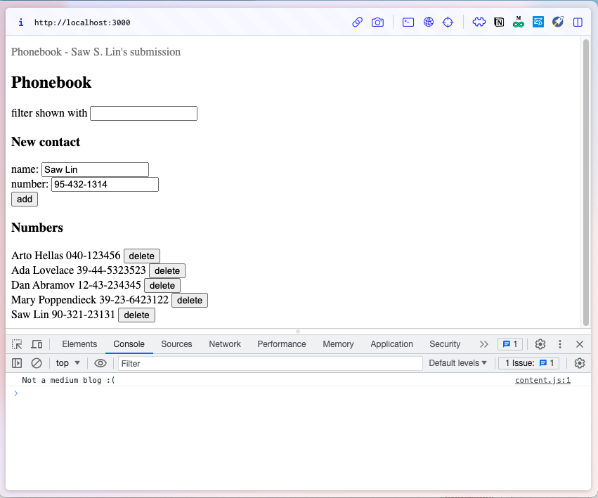 | 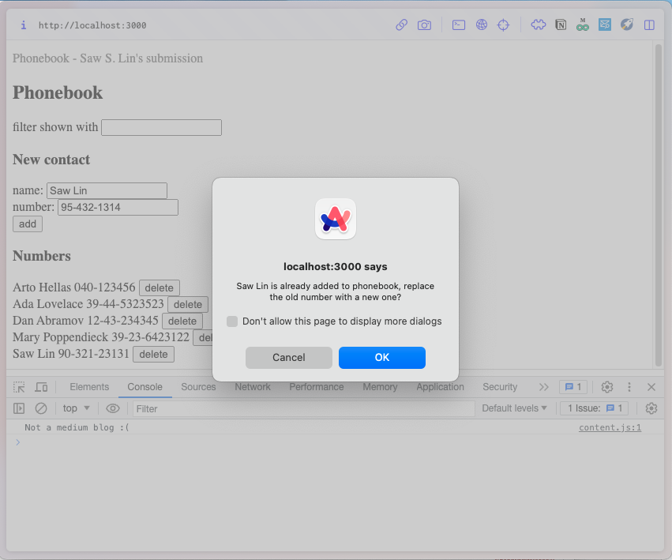 | 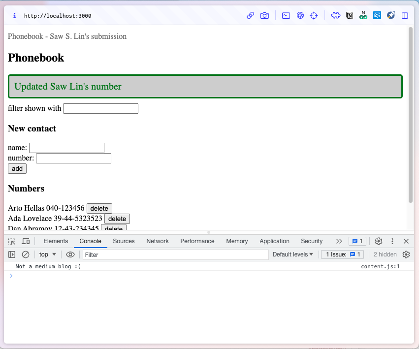 |

## 4. Delete a person
| a. Deleting a person... | b. Person successfully deleted |
|:-------:|:-------:|
| 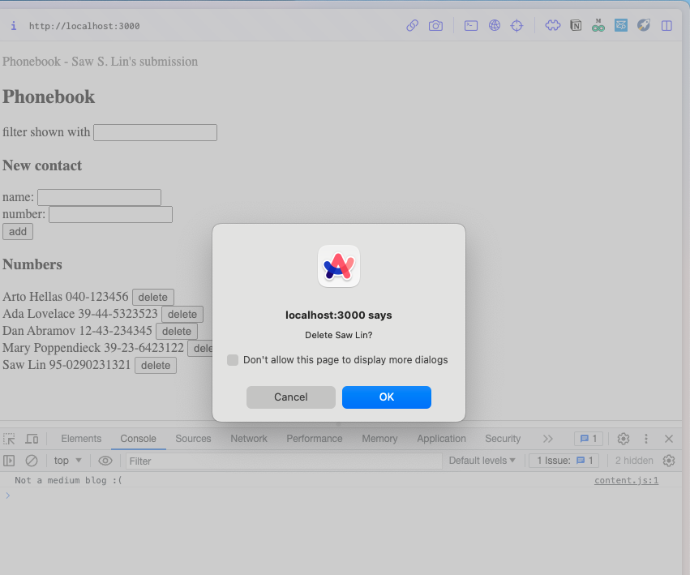 | 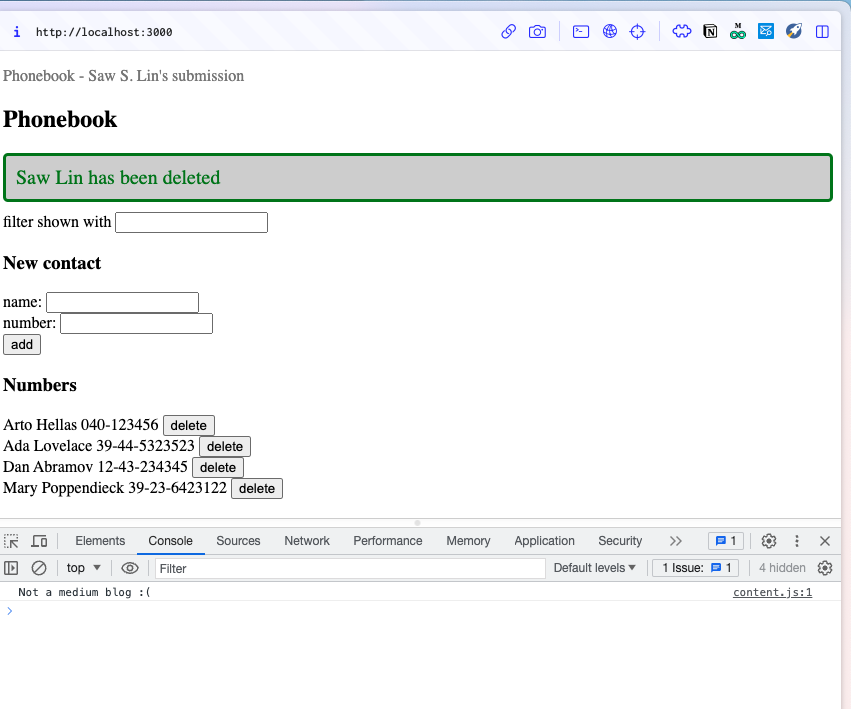 |

## 5. Open two tabs side by side, delete person on one tab, and then try to update number of the deleted person
| a. Deleting a person... | b. Person deleted on the right tab, but remains on the left |
|:-------:|:-------:|
| 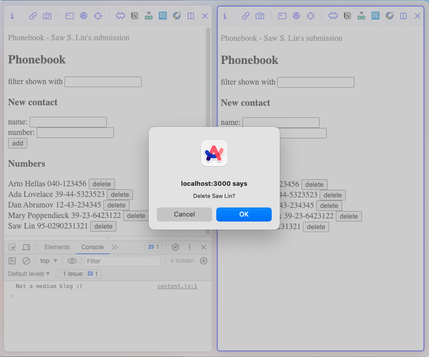 | 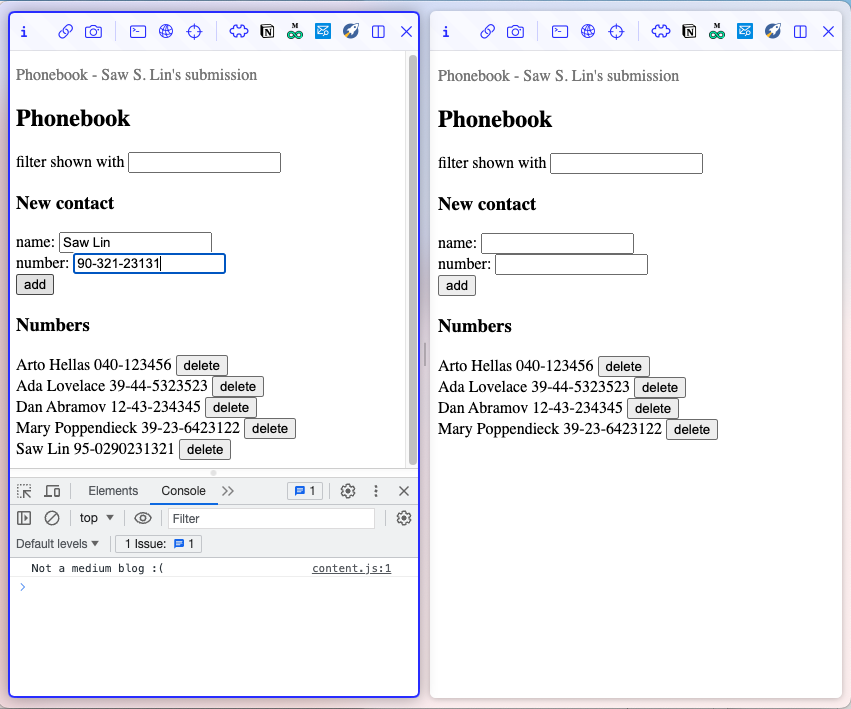 |

| c. Updating the deleted person's number... | d. App says the person has been deleted, gracefully handling the error |
|:-------:|:-------:|
| 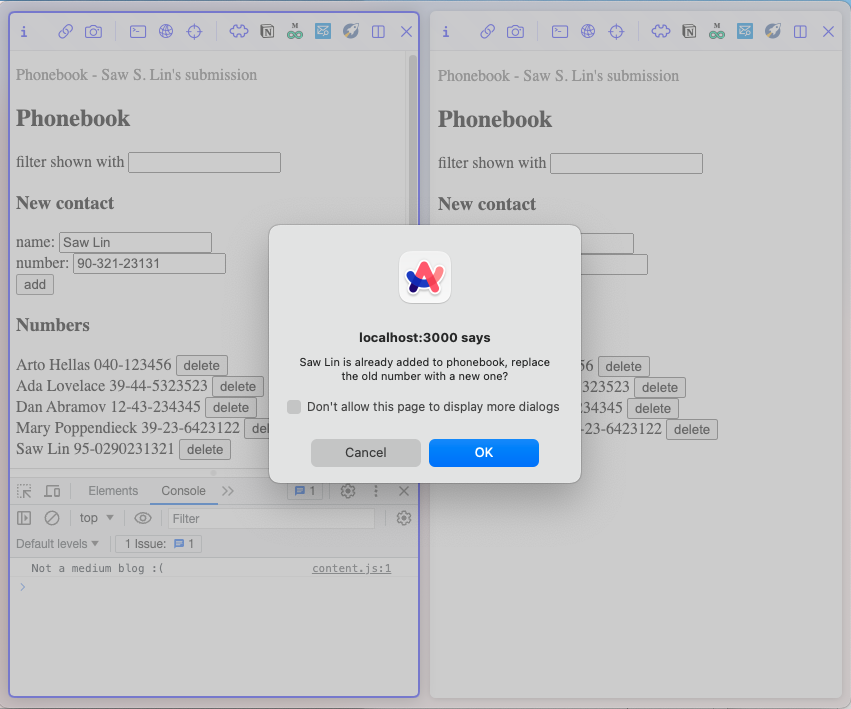 | 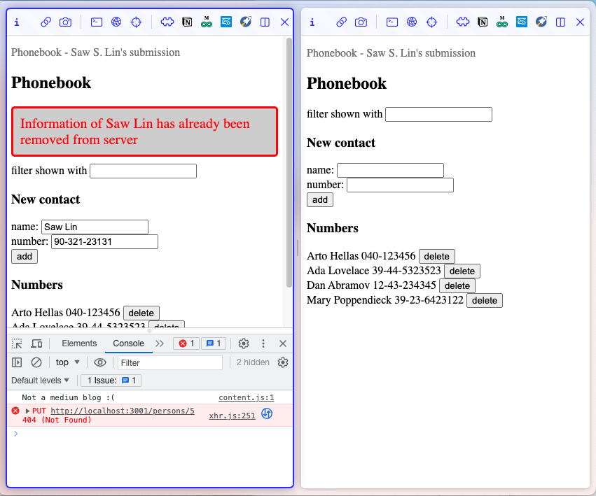 |
